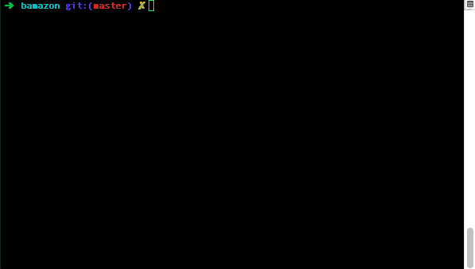
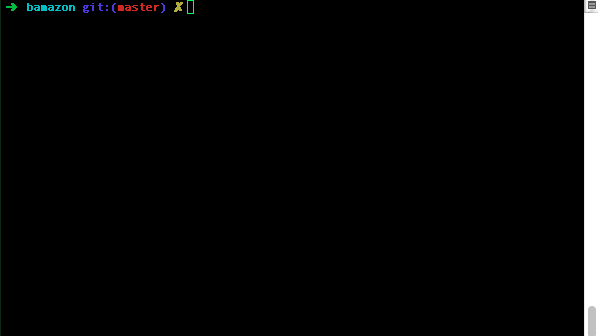
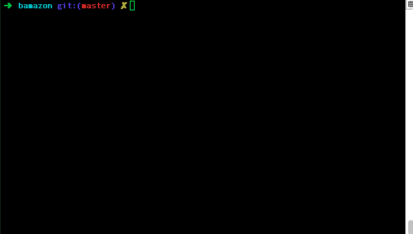

# bamazon
Amazon-like storefront with MySQL. The app will take in orders from customers and deplete stock from the store's inventory

## What this accomplishes 
This is a simple eCommerce-like application via command-line. As a customer one can query the database and buy items. As a manager one can view products for sale, which items have low inventory, add to the inventory, and add a completely new product. Lastly, as a spuerisor, one can view product sales, overhead costs, and total profit by department as well as create an entirely new product-department.

## High-level overview of how the app is organized
This app prompts the user for actions, and based on their actions we query or make modifications to the database, or run on-the-fly calculations. 

## Technologies used in the app
* [Node](https://nodejs.org/en/)
* [Node Package Manager](https://www.npmjs.com/)
* [mySQL](https://www.mysql.com/)
* [mysql node package](https://www.npmjs.com/package/mysql)
* [inquirer node package](https://www.npmjs.com/package/inquirer)
* [cli-table node package](https://www.npmjs.com/package/cli-table)

## Role in the app development
I wrote the entire thing in javascript for the "front-end", powered by mySQL database on the backend.

## Instructions on setting-up the app

1. This assumes familiarity with SQL, so once you get mySQL up and running you can use the `sql_seeding.sql` file to inject dummy data

2. Edit the `.js` files with your connection config such as port, username, and password:
```
  host: "localhost",
  port: 3306,
  user: "root",
  password: "password",
  database: "bamazon"
```

3. Iinstall the node packages outlined in `package.json` with the following command in the root folder:
`npm install` 

Once you've done that you're set to go!

## Using the app and examples

Navigate to the root folder and type commands like this:

`node bamazonCustomer.js`

This will allow you to buy items in the database

`node bamazonManager.js` 

This will allow you to:

* `View Products for Sale` - View all products available 
* `View low inventory` - View all items with less than 5 stock
* `Add New Product` - Add a new product to the database
* `Exit`

`node bamazonSupervisor.js`

This will allow you to:

* `View Product Sales by Department` - You can view a table of all departments and their sales, overhead costs, and subtract those two for the profit
* `Create New Department` - You can add a new department so that you can add items to that department when running `bamazonManager.js` when selecting `Add New Product` 

## See it in action

bamazonCustomer.js: 



bamazonManager.js: 



bamazonSupervisor.js: 




